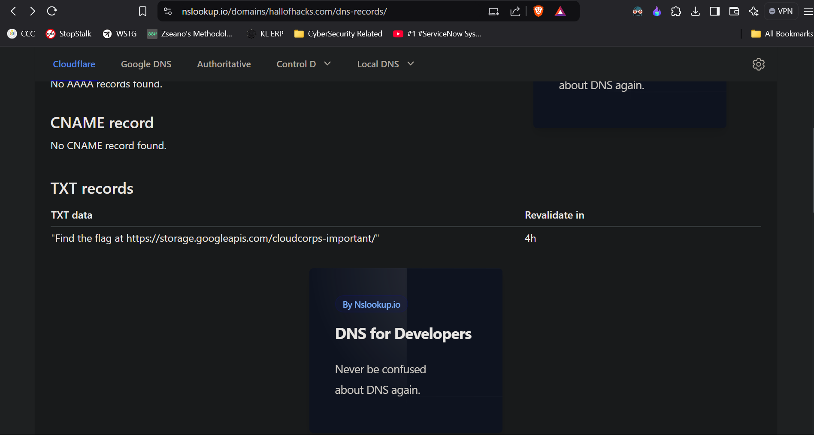
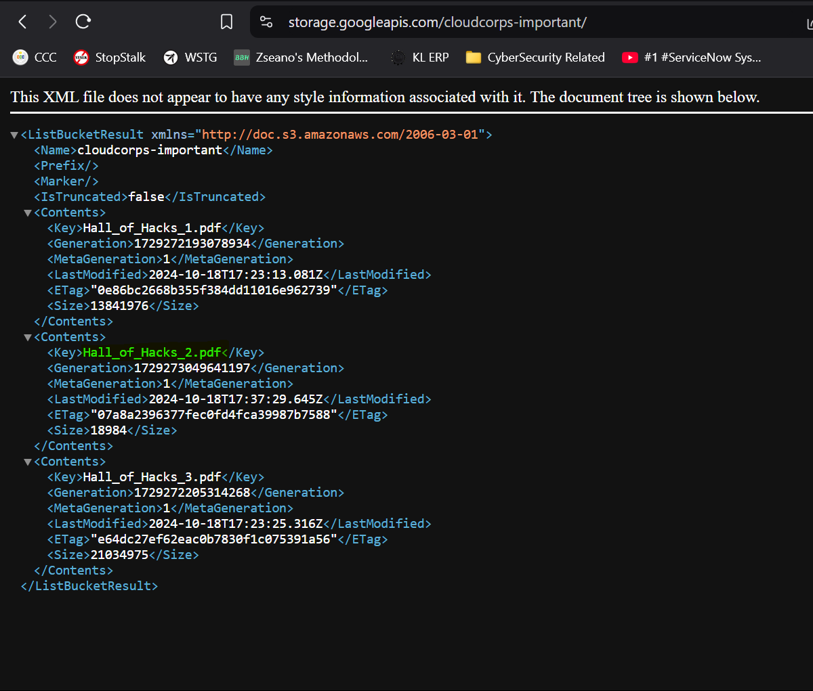
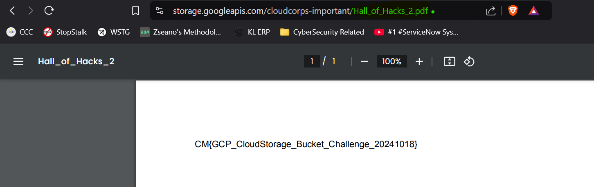

# CTF Write-Up: Cloudy Records

## Introduction

This write-up discusses the challenge: **Cloudy Records** from the **Hack Havoc 2.0** CTF.

## Required Information

- **CTF Name:** Hack Havoc 2.0
- **Challenge Name:** Cloudy Records
- **Challenge Category:** Cloud
- **Challenge Points:** 100

## Content

### Step 1: Inspect the Website and Check DNS Records
Starting with the website, I initially found no visible clues, so I conducted a DNS lookup for hidden records.
The DNS lookup revealed a TXT record containing a URL hint: [https://storage.googleapis.com/cloudcorps-important/](https://storage.googleapis.com/cloudcorps-important/).

### Step 2: Examine Storage Contents and Find the Flag
At the URL, I accessed an XML file listing various storage records. By checking each file in the URL, I located the flag within `Hall_of_Hacks_2.pdf`.

## Flag: 
    CM{GCP_CloudStorage_Bucket_Challenge_20241018}               

