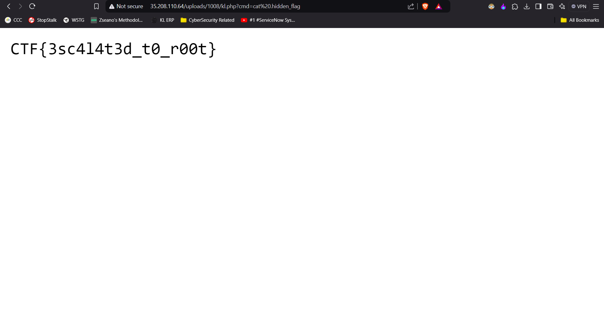

# CTF Write-Up: Hacker's Fortress

## Introduction

This write-up discusses the challenge: **Hacker's Fortress** from the **Hack Havoc 2.0** CTF.

## Required Information

- **CTF Name:** Hack Havoc 2.0
- **Challenge Name:** Hacker's Fortress
- **Challenge Category:** Boot to Root
- **Challenge Points:** 50

## Content
The **Hacker's Fortress** challenge required gaining access to a hidden flag within the server. To solve it, I first registered an account and logged in. Then, I uploaded a simple PHP reverse shell and used its URL to navigate through the server directories. After locating a file named `.hidden_flag`, I accessed its contents by using the `cat` command, which revealed the flag. This sequence of steps successfully uncovered the hidden flag needed to complete the challenge.

## Flag: 
    CTF{3sc4l4t3d_t0_r00t}
                 

