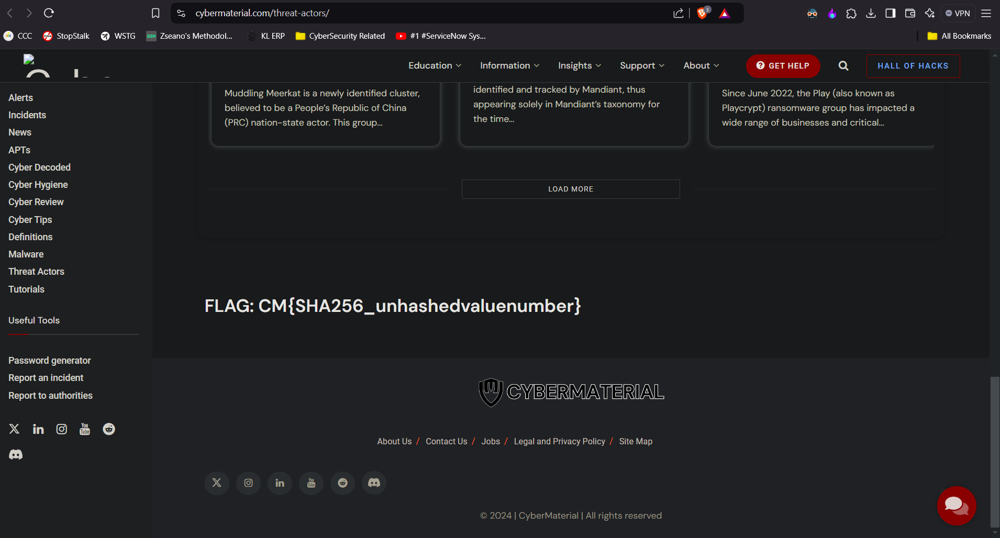

# CTF Write-Up: Hashing Numbers

## Introduction

This write-up discusses the challenge: **Hashing Numbers** from the **Hack Havoc 2.0** CTF.

## Required Information

- **CTF Name:** Hack Havoc 2.0
- **Challenge Name:** Hashing Numbers
- **Challenge Category:** Web
- **Challenge Points:** 50

## Content
The Hashing Numbers: Web challenge required unscrambling a SHA-256 hash. Here’s the solution:
### Step 1: Unscramble of 742AJM
The website presented the scrambled value 742-AJM. Recognizing that the challenge involved SHA-256, I used the keypad of a phone to unscramble the characters.

### Step 2: Access the Google Form
After unscrambling, I entered the value, which directed me to a Google Form. I used Inspect Element on the "your answer" field to dig deeper.

### Step 3: Reveal the Hash
In the Google Form's "your answer" field, I found the actual hash. With the Dark Reader extension active, I could easily spot the hidden hash that satisfied the condition.

### Step 4: Decode the Hash
Decoding the hash revealed the number 50. 

We get the flag as: CM{SHA256_50} and we need to write this in the format as specified in the description

## Flag: 
    CM{SHA-256_50}
                 

