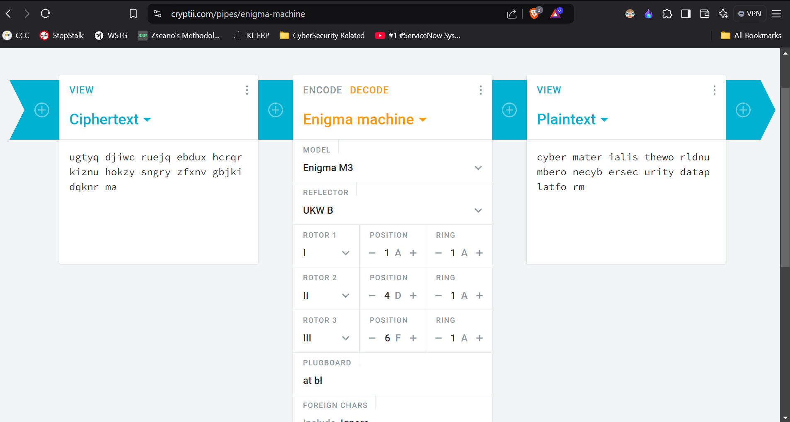

# CTF Write-Up: More Like ‘Enig-me’

## Introduction

This write-up discusses the challenge: **More Like ‘Enig-me’** from the **Hack Havoc 2.0** CTF.

## Required Information

- **CTF Name:** Hack Havoc 2.0
- **Challenge Name:** More Like ‘Enig-me’
- **Challenge Category:** Rev
- **Challenge Points:** 40

## Content
The More Like ‘Enig-me’ challenge involved reverse engineering a modified Enigma machine encryption. The encoded text provided was:
ugtyq djiwc ruejq ebdux hcrqr kiznu hokzy sngry zfxnv gbjki dqknr ma
The decoded message, "cybermaterial is the world number one cybersecurity data platform," confirmed that deciphering the correct settings for the Enigma machine was essential to reveal the flag.

Hints provided on Discord led me to configure the Enigma machine settings as follows:

### Enigma Settings
- **Rotor Order:** I, II, III
- **Initial Rotor Position:** A, D, F
- **Reflector:** B
- **Plugboard Settings:** A-T, B-L
- **Ring Position:** A, A, A (no shifts)

Using these settings, I configured an Enigma machine emulator to decode the message correctly.

## Flag: 
    CM{Rotor_I-II-III_Pos_A-D-F_Reflector_B_Plug_A-T_B-L_Ring_A-A-A}
               

