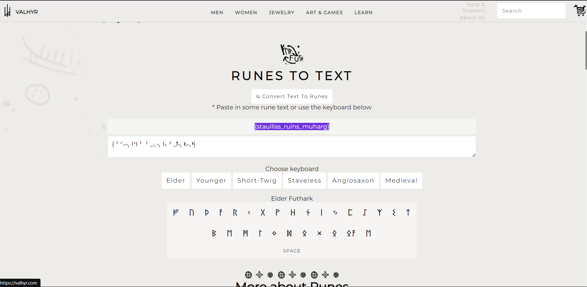

# CTF Write-Up: The Curious Case of the Jumbled Symbols

## Introduction

This write-up discusses the challenge: **The Curious Case of the Jumbled Symbols** from the **Hack Havoc 2.0** CTF.

## Required Information

- **CTF Name:** Hack Havoc 2.0
- **Challenge Name:** The Curious Case of the Jumbled Symbols
- **Challenge Category:** Crypto
- **Challenge Points:** 40

## Content

The **Curious Case of the Jumbled Symbols** challenge involved deciphering a sequence of mysterious runic characters: `{╵⸍⸝╮ᛁ⸌ᛁ╵╵_◟╮ᛁ⸜╵_ᛙ╮ᚽ⸝◟ᛍ}`. To solve it, I used a rune translator, available at [Valhyr Rune Translator](https://valhyr.com/pages/rune-translator), to interpret the symbols.

The translation revealed the flag as: {stauiliss_ruins_muharg}

## Flag: 
    CM{{stauiliss_ruins_muharg}

                 

