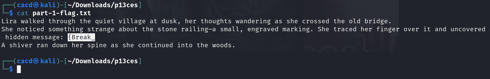
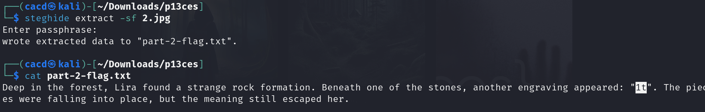
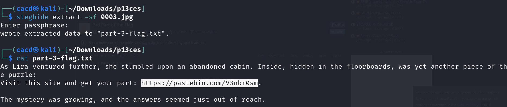
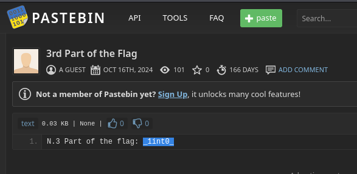
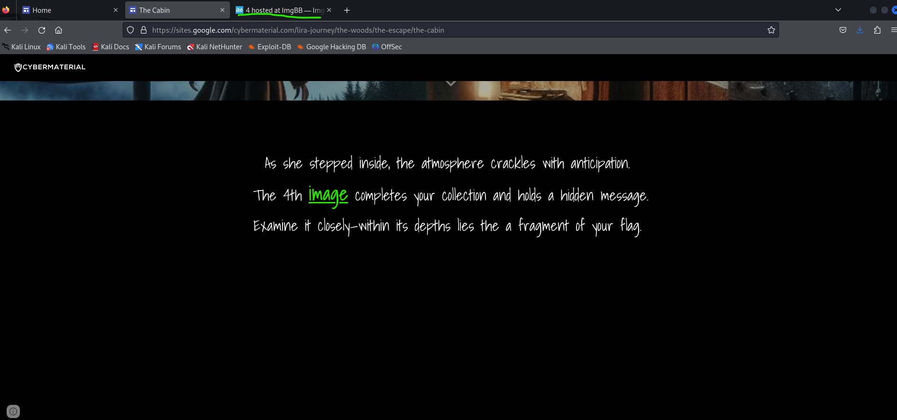
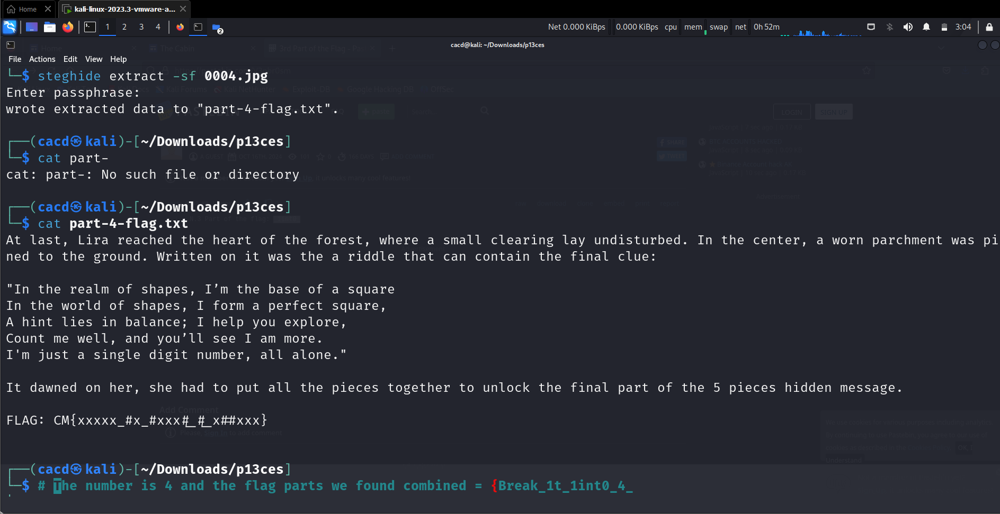
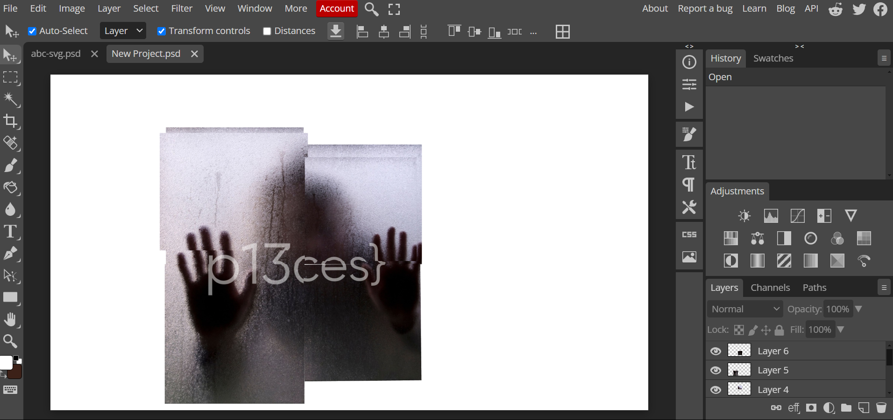

# CTF Write-Up: p13ces

## Introduction

This write-up discusses the challenge: **p13ces** from the **Hack Havoc 2.0** CTF.

## Required Information

- **CTF Name:** Hack Havoc 2.0
- **Challenge Name:** p13ces
- **Challenge Category:** Stego
- **Challenge Points:** 100

## Content
The p13ces challenge involved uncovering flag parts hidden within images on a website. I approached it using the following steps:

### Step 1: Exploring the Website
I started by examining images on the challenge website, manually using steghide on each one without any password until I reached an image located at this link. Here, I found image, which contained the first part of the flag.

### Step 2: Unlocking Image 2
The flag part in image 1 served as the password for decrypting image 2, revealing the next portion of the flag.

And continuing further we get

And Futher we get pastebin URL

And we get the password for the image 3 

### Step 3: Accessing Image 4 
I the flag in image 4 to decrypt image 4. Within this flag part, a hint confirmed that the final number needed for reconstruction was "4."

So far we got the parts as {Break_1t_1int0_4
### Step 4: Combining Flag Parts
With all parts gathered, I used an image editor like Photoshop or Photopea to combine the flag parts physically, revealing the complete flag.

## Flag: 
    CM{Break_1t_1int0_4_p13ces}                 

